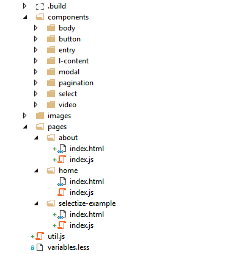
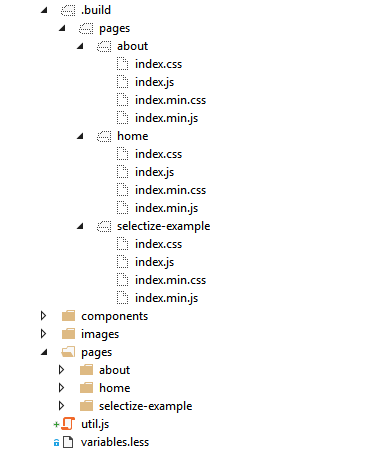

## Сборка фронтенда


---

```css
.example {
    display: -webkit-box;
    display: -webkit-flex;
    display: -ms-flexbox;
    display: flex;
    -webkit-transition: all .5s;
    -o-transition: all .5s;
    transition: all .5s;
    -webkit-user-select: none;
       -moz-user-select: none;
        -ms-user-select: none;
            user-select: none;
    background: -webkit-gradient(linear, left top, left bottom, from(white), to(black));
    background: -webkit-linear-gradient(top, white, black);
    background: -o-linear-gradient(top, white, black);
    background: linear-gradient(to bottom, white, black);
}
```

---

```css
.example {
    display: flex;
    transition: all .5s;
    user-select: none;
    background: linear-gradient(to bottom, white, black);
}
```

Autoprefixer использует самые свежие данные с [caniuse.com](http://caniuse.com/) при добавлении только необходимых префиксов

<!-- .element: class="fragment" -->

---




---



---


#### Пример компонента "entry"

* Шаблон <!-- .element: class="fragment" -->
* Стили <!-- .element: class="fragment" -->
* Скрипт <!-- .element: class="fragment" -->

Всё лежит в одной папке, в "app/components/entry/"

<!-- .element: class="fragment" -->

---

```html
<div class="entry">
    <h2 class="entry__title" data-bind="text: params.title"></h2>
    <p class="entry__body" data-bind="text: params.body"></p>
</div>
```

```css
@import "../../variables.less";

.entry {...}

.entry__title {...}

.entry__body {...}
```

<!-- .element: class="fragment" -->

```js
require('./style.less');
var template = require('./template.html');

ko.components.register('ko:entry', {
    template: template,
    viewModel: function(params) {this.params = params},
});
```

<!-- .element: class="fragment" -->
